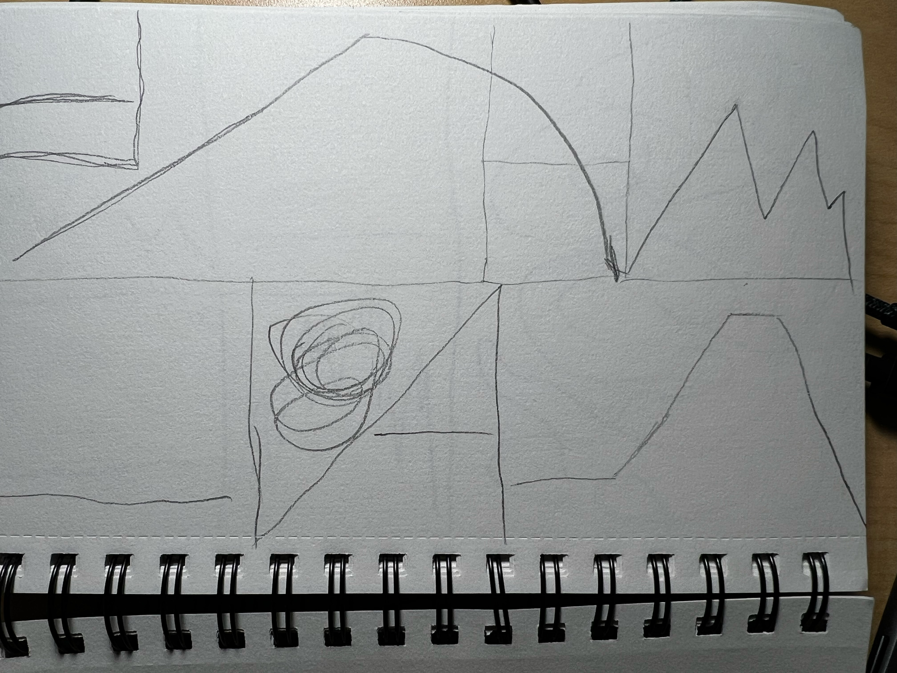
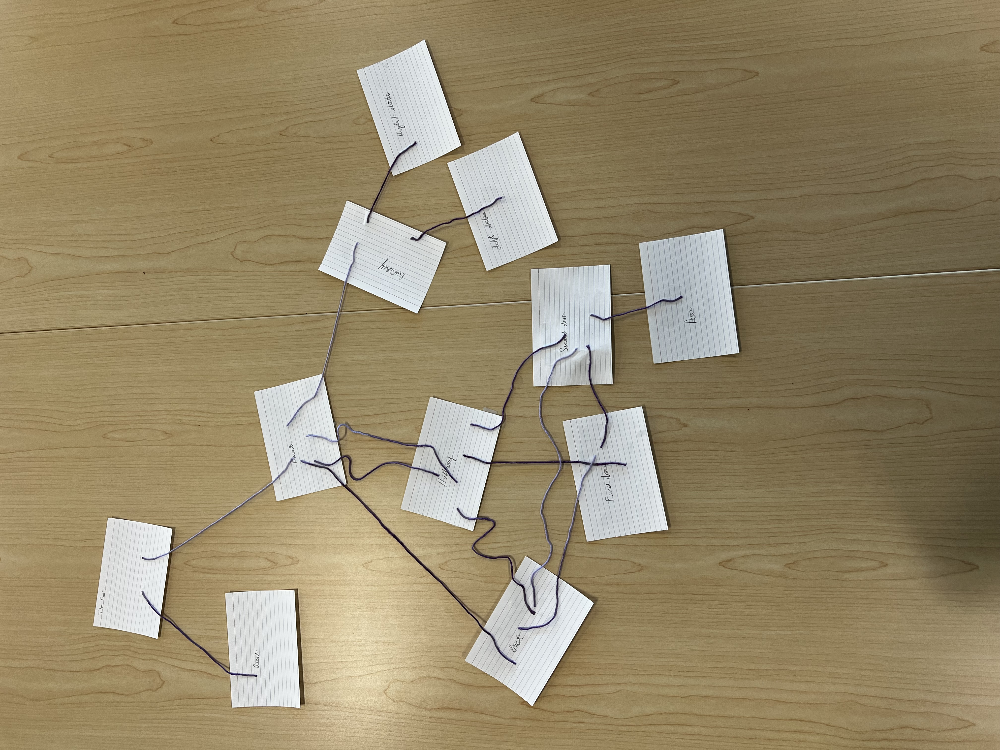
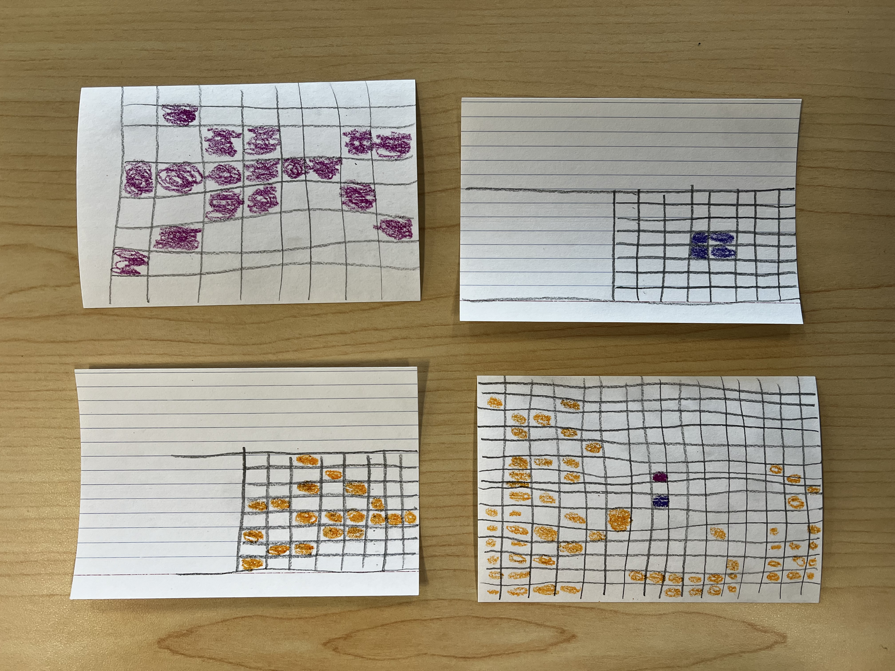

# Jon Breitenbucher's Portfolio

Welcome! Here, you will find a selection of projects from the Critical Making DHSI Workshop. Feel free to explore the links below to learn more about each project that we worked on during the workshop.

## Projects

* Grids & Gestures
 - 
 - 
* [Twine Project](Twine_Project/MysteryHouse.html)
 - 
* [Bitsy Project](Bitsy/apple_picking.html)
 - 
* [Taroko Gorge Remix](Taroko_Remix/Taroko%20Gorge.html)
* [P5 Project](P5/index.html)
* [Tracery Project](Tracery/Tracery%20to%20HTML%20Template.html)
* [Tracery Haiku Project](Tracery/tracery-haiku/index.html)